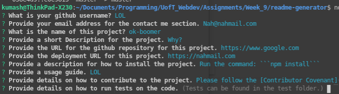

  # [Readme Generator](https://www.github.com/Logner/readme-generator)

  ## Description 
  This is a node js based readme markdown generator. It uses inquirer to collect user responses via commandline and formats the collected prompt information into professionally formatted readme files.

  ## Table of Contents  
  * [Installation](#installation)
  * [Usage](#usage)
  * [Contributing](#contributing)
  * [License](#license)
  * [Contact](#contact)
  
  
  ## Installation
  
  Run the command: ```npm install```
  
  ## Usage 
  
  Run the command: ```index.js``` and answer the prompts as best as you can.

  A screenshot of the application can be found below:
  
  

  
  ## License

  
  
  This project is licensed under Apache Licence. You can read more about it [here](https://choosealicense.com/licenses/).
  
  ## Contributing
  
  Please follow the [Contributor Covenant](https://www.contributor-covenant.org/)

  ## Tests
  
  No testing has been implemented yet  

  ## Contact

  This project is made by [Logner](https://www.github.com/Logner/), you can send an email to them by clicking [here](mailto:kumash123@gmail.com)
